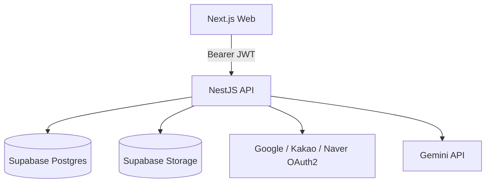
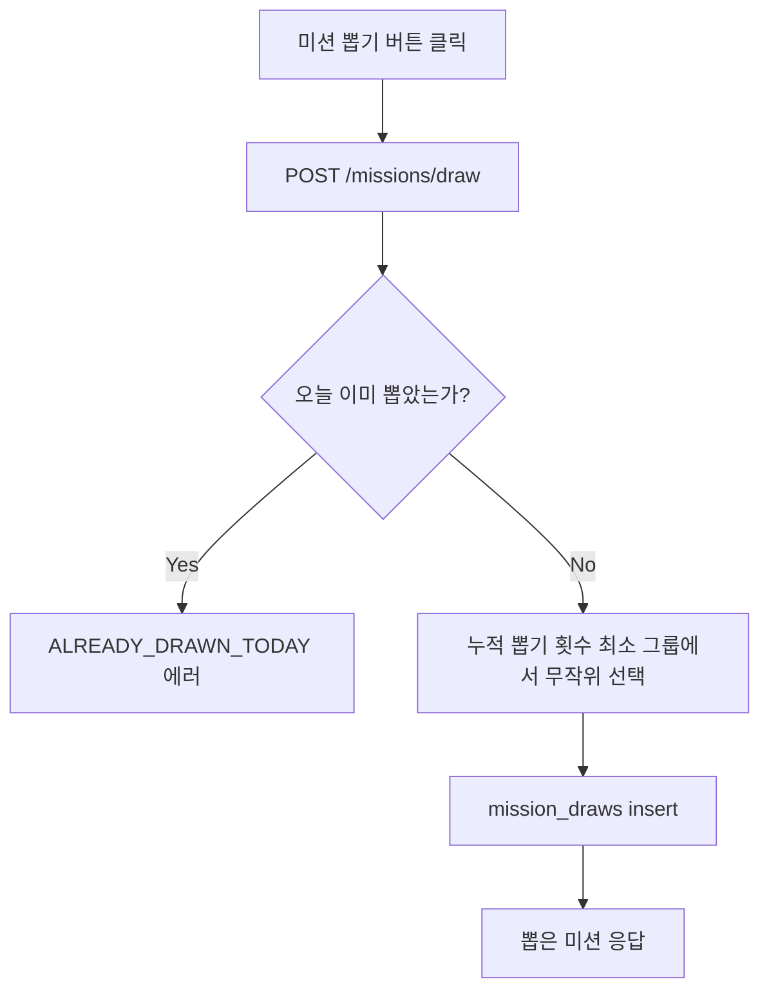

# 새틈 (Saeteum)

> 매일 하루에 하나씩 무작위로 받는 가벼운 미션으로, 틈날 때 부담 없이 새로움을 경험하는 서비스

**🌐 Live:** (배포 전)


---

## 📖 About

### Why

반복되는 하루 속에서 "하늘 사진 찍기", "10분 산책하기"처럼 오래 걸리지도 어렵지도 않지만 굳이 하지 않게 되는 사소한 행동들을, 매일 하나씩 무작위로 제안받아 시도해볼 수 있게 하고 싶어서 시작했다.

이름 "새틈"은 "시간을 따로 내서 하는 것이 아니라 틈날 때 경험할 수 있는 새로움"이라는 의미를 담고 있으며, 슬로건은 "틈만 나면, 새로움"이다.

### Problem

- 반복되는 일상 속에서, 부담 없이 시도할 수 있는 작은 새로움을 스스로 찾아 시도하기 어렵다.
- 습관 형성 앱처럼 매일 강제되는 루틴은 오히려 부담과 압박으로 이어질 수 있다.

### Solution

- 하루 1개, 재뽑기 불가능한 랜덤 미션을 제공해 "오늘 뭘 해야 할지" 고민하지 않게 한다.
- 완료 인증을 요구하지 않고, 후기 작성도 선택 사항으로 둬 강제성을 없앤다.
- 후기가 쌓이면 감정/성향 패턴을 분석해주는 개인화된 기록으로 확장한다. 소셜 기능 없이 개인의 기록에만 집중한다.

---

## ✨ Features

현재 구현된 핵심 기능은 다음과 같다.

### 소셜 로그인

구글 / 카카오 / 네이버 OAuth2 로그인. Supabase Auth를 거치지 않고 NestJS가 각 프로바이더와 직접 연동하며, 자체 Access/Refresh JWT를 발급한다.

### 오늘의 미션 뽑기

하루 1회, 재뽑기 없이 무작위 미션을 뽑는다(KST 자정 리셋). 미션은 사용자별 누적 뽑기 횟수가 가장 적은 그룹에서 무작위로 선택되어 특정 미션에 편중되지 않는다.

### 후기 작성 · 조회 · 삭제

별점, 사진, 텍스트, 감정 태그 중 하나 이상을 입력하면 저장되는 선택적 후기 기록. 사진은 Supabase Storage(private)에 저장되고 signed URL로만 조회된다.

### 기록 조회

카테고리별로 미션 개수만큼 박스를 두고, 아직 뽑지 않은 미션은 물음표로, 뽑은 미션만 실제 내용을 보여주는 기록 화면.

### 실시간 통계

뽑기/후기 데이터를 기반으로 한 통계 화면. 미션을 뽑거나 후기를 남기면 캐시를 무효화해 최신 상태를 반영한다.

### 마이페이지

닉네임 수정, 로그아웃, 회원 탈퇴.

### AI 인사이트 (진행 중)

후기 마일스톤(10 / 30 / 50개)에 따라 감정 흐름·카테고리 성향을 분석해주는 화면. 현재는 프론트엔드 레이아웃까지 구현되었고, Gemini API 연동은 아직 진행 전이다.

---

## 🏗️ Architecture



Next.js는 화면 렌더링과 함께 인증 토큰 처리를 위한 최소한의 BFF(Route Handler)를 겸하고, 실제 도메인 로직과 데이터 접근은 NestJS API가 전담한다.

### Core Flow — 오늘의 미션 뽑기



---

## 🛠️ Tech Stack

| Category        | Technology                              |
| --------------- | --------------------------------------- |
| Frontend        | Next.js (App Router), React, TypeScript |
| Styling         | Tailwind CSS                            |
| Animation       | Motion                                  |
| Backend         | NestJS                                  |
| Authentication  | 자체 구현 (OAuth2 직접 연동 + 자체 JWT) |
| ORM             | Drizzle                                 |
| Database        | Supabase (PostgreSQL)                   |
| File Storage    | Supabase Storage (private)              |
| AI              | Gemini API                              |
| Validation      | Zod (`nestjs-zod`)                      |
| API Docs        | Swagger/OpenAPI                         |
| Package Manager | pnpm (workspace monorepo)               |
| Testing         | Jest, Playwright                        |
| Infrastructure  | Vercel (Frontend) / Render (Backend)    |

---

## 🚀 Getting Started

### Prerequisites

- Node.js
- pnpm

### Installation

```bash
pnpm install
```

### Environment

`apps/web`와 `apps/api`에 각각 `.env`가 필요하다. 주요 환경 변수는 다음과 같다.

```env
# apps/api
PORT=
DATABASE_URL=
SUPABASE_URL=
SUPABASE_SERVICE_ROLE_KEY=
WEB_ORIGIN=
JWT_SECRET=
AUTH_STATE_SECRET=
GOOGLE_CLIENT_ID=
GOOGLE_CLIENT_SECRET=
KAKAO_CLIENT_ID=
KAKAO_CLIENT_SECRET=
NAVER_CLIENT_ID=
NAVER_CLIENT_SECRET=

# apps/web
NEXT_PUBLIC_API_URL=
```

### Development

```bash
pnpm dev
```

---

## 🧪 Testing

### Unit Tests

```bash
pnpm test
```

### E2E Tests

```bash
pnpm test:e2e
```

---

## 🗓️ Roadmap

| Version | Goal                                                       | Status         |
| ------- | ---------------------------------------------------------- | -------------- |
| v0.1.0  | MVP — 소셜 로그인, 미션 뽑기, 후기, 기록, 통계, 마이페이지 | 🚧 In Progress |
| v0.2.0  | 후기 수정, 마일스톤 기반 AI 분석                           | ⬜             |
